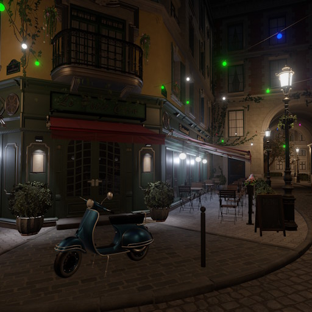

# ezEngine Sample Project "Bistro"

This repository contains an [ezEngine](https://ezengine.net) sample project showing the [Amazon Lumberyard Bistro](https://developer.nvidia.com/orca/amazon-lumberyard-bistro) scene.

## Purpose

The sample scene has a very basic setup. The entire geometry is imported as one large mesh. As such, it is nice to look at, but can't be used for measuring performance, since it represents the worst case scenario for the engine.

However, it contains a lot of data, mainly texture data. On disk textures are highly compressed with JPEG and PNG, but for rendering they expand to nearly 3 GB of data.

Consequently, there are two main cases that the project demonstrates:

* Asset processing times - how fast data is encoded to the target formats
* Scene loading times - how fast the data is loaded by the engine on startup

## Controls

When starting the scene, an automatic camera path plays. Use `Page Up` / `Page Down` to detach / reattach the camera to the path.

Use `F1` to open the ingame console for stats, or press `F5` to only show FPS information.